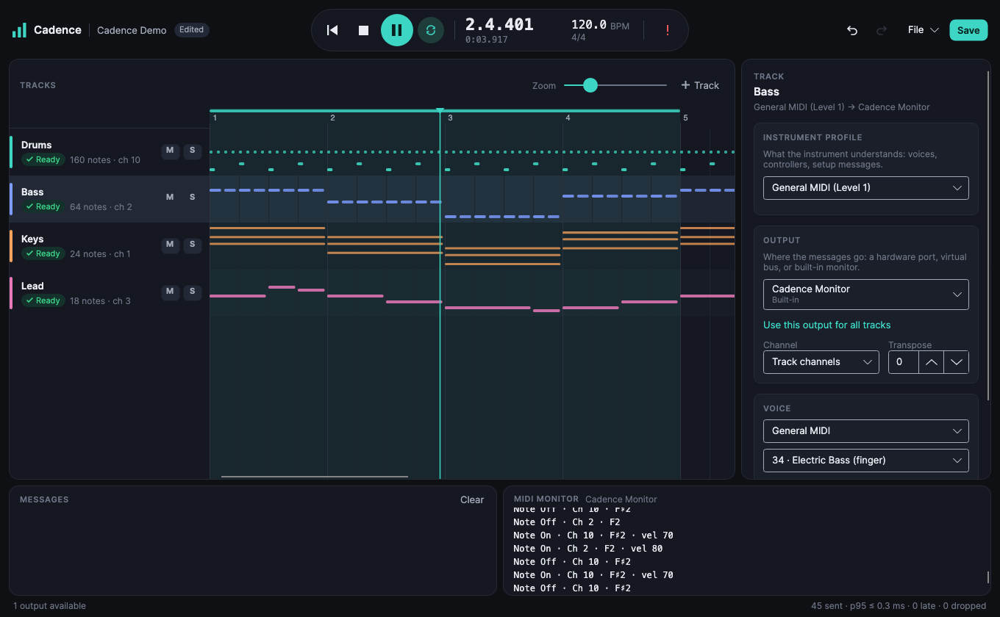

# Cadence

Cadence is a modern, open-source, cross-platform MIDI workstation built for musicians who use real instruments.

It is initially focused on excellent Yamaha XG and QY100 workflows, while its architecture is deliberately broader: Cadence can describe what an instrument understands independently from where MIDI is sent. A track can therefore use a device profile with physical hardware, a virtual MIDI port, a network destination, or a compatible software instrument.

> [!NOTE]
> Cadence is an independent open-source project and is not affiliated with, authorized, sponsored, or endorsed by Yamaha Corporation. Yamaha, XG, QY100, and other product names and trademarks belong to their respective owners and are used solely to describe compatibility.



## Status

Cadence is in early development and not yet ready for production use or live performance. Today it can import a Standard MIDI File, route each track to a device profile and an output independently, play it through CoreMIDI on macOS (hardware, IAC, or its own *Cadence Out* virtual port for software synths) with measured timing, show what was sent in a built-in MIDI monitor, and save and reopen projects safely. Windows and Linux MIDI adapters and note editing are next.

## Goals

- Hardware-first MIDI sequencing, recording, editing, and playback
- Reliable timing with measurable scheduling behavior
- First-class, data-defined device profiles for voices, banks, controllers, effects, SysEx, and capabilities
- Independent MIDI endpoints for physical, virtual, network, and future hosted-software destinations
- A portable project format that survives missing or renamed devices
- Standard MIDI File import and export with honest reporting of lossy conversions
- Accessible cross-platform desktop workflows
- A clean extension path for GM, GM2, XG, GS, and community-defined instruments

## Architectural principle

Cadence separates a **device profile** from a **MIDI endpoint**:

```text
Track / logical part
        |
        +-- Device profile: what the instrument understands
        |      voices, banks, controllers, SysEx, capabilities
        |
        +-- MIDI endpoint: where messages are sent
               physical port, virtual port, network, software instrument
```

That makes all of these legitimate configurations:

```text
QY100 profile       -> physical QY100
QY100 profile       -> compatible XG software synth
Generic XG profile  -> physical XG module
GM/GM2 profile      -> arbitrary compliant endpoint
Custom profile      -> virtual MIDI port
```

Profiles are not ports, and ports are not instruments. Projects retain their musical intent even when a previously selected endpoint is unavailable.

## Technology direction

Cadence uses .NET and C# for its domain, application, persistence, profile, and cross-platform UI code. Platform adapters isolate operating-system MIDI services.

C or C++ components may be introduced where native MIDI APIs or measured high-resolution scheduling requirements justify them. Any native component must remain behind a narrow, versioned C ABI; vendor knowledge and domain rules stay in managed code.

## Repository layout

```text
Cadence/
├── LICENSE
├── README.md
├── global.json
├── docs/
│   ├── adr/            Architecture decision records
│   ├── midi-files.md   Standard MIDI File behavior and diagnostics
│   ├── profiles.md     Device profile format
│   └── project-format.md  Cadence project files, saving, and recovery
├── profiles/           Shipped device profiles (data, not code)
├── samples/            Redistributable demo and fixture files
└── src/
    ├── Cadence.slnx
    ├── SubModules/
    └── <ProjectFolder>/
```

- `src/Cadence.slnx` is the solution entry point.
- `src/SubModules/` is reserved for shared source submodules.
- Each normal project belongs in its own direct child folder under `src/`.
- `docs/adr/` records consequential architecture decisions.
- `profiles/` holds device profile data; see `profiles/README.md` for contribution rules.

The repository is intentionally minimal while the first vertical slice is designed. Empty architectural layers should not be generated simply to match a diagram.

## Building

Install the [.NET 10 SDK](https://dotnet.microsoft.com/download) (10.0.300 or a later 10.0 feature band; see `global.json`), then from the repository root run:

```sh
dotnet restore src/Cadence.slnx
dotnet build src/Cadence.slnx
dotnet test src/Cadence.slnx
dotnet format src/Cadence.slnx --verify-no-changes
```

Warnings are treated as errors and code style is enforced during build. Tests run on Microsoft.Testing.Platform; the default suite needs no MIDI hardware. Platform MIDI adapters may require their target operating system.

## Running Cadence

```sh
dotnet run --project src/Cadence.Desktop
```

Without any hardware, route tracks to **Cadence Monitor** and watch the messages in the MIDI
monitor panel, or route to **Cadence Out** and select it as the input of a software synth or DAW.
A demo song is included in `samples/cadence-demo.mid`. Hardware checks are listed in
[docs/hardware-test-plan.md](docs/hardware-test-plan.md).

| Action | Shortcut |
| ------ | -------- |
| Play / pause | Space |
| Return to start | Home |
| Loop four bars from the playhead | L |
| Panic (silence every output) | Ctrl/Cmd + . |
| Undo / Redo | Ctrl/Cmd + Z / Ctrl/Cmd + Shift + Z |
| New, Open, Save, Save As | Ctrl/Cmd + N, O, S, Shift + S |
| Import / Export MIDI | Ctrl/Cmd + I / E |
| Add track | Ctrl/Cmd + T |

Accessibility: every control has a screen-reader name, status is always shown with an icon and a
word as well as colour, and all transport and file actions have keyboard shortcuts. Linux
screen-reader support has not yet been verified.

## Contributing

Cadence welcomes focused contributions to sequencing, MIDI interoperability, device profiles, platform adapters, accessibility, documentation, and testing.

Before contributing:

1. Read the architectural principle above and the decision records in `docs/adr/`.
2. Keep device profiles independent from MIDI endpoint implementations.
3. Include tests that do not require contributors to own specific hardware.
4. Identify hardware behavior that was simulated rather than physically verified.
5. Include provenance for profile data and only submit material you have the right to redistribute.
6. Do not contribute vendor logos, manual scans, firmware, ROM content, proprietary binaries, or copied vendor artwork/text.

Compatibility names must be used factually and must not imply vendor affiliation, certification, sponsorship, or endorsement.

## License

Cadence is licensed under the [MIT License](LICENSE).
