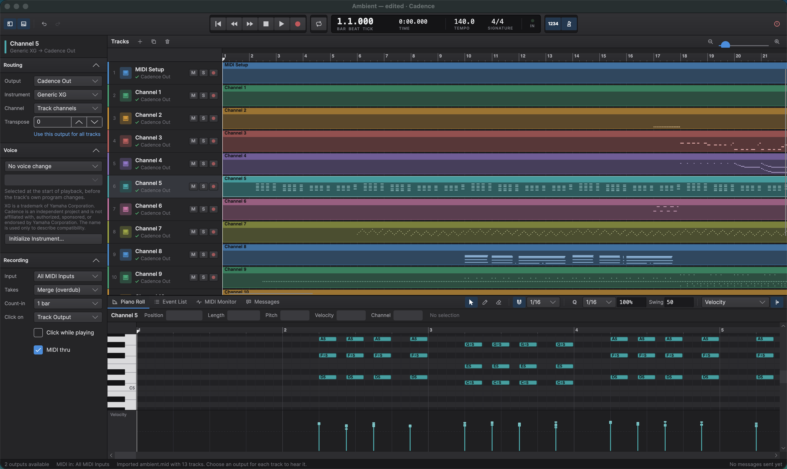

# Cadence

[](https://github.com/djflan/Cadence/actions/workflows/ci.yml)

Cadence is a modern, open-source, cross-platform MIDI workstation built for musicians who use real instruments.

It is initially focused on excellent Yamaha XG and QY100 workflows, while its architecture is deliberately broader: Cadence can describe what an instrument understands independently from where MIDI is sent. A track can therefore use a device profile with physical hardware, a virtual MIDI port, a network destination, or a compatible software instrument.

> [!NOTE]
> Cadence is an independent open-source project and is not affiliated with, authorized, sponsored, or endorsed by Yamaha Corporation. Yamaha, XG, QY100, and other product names and trademarks belong to their respective owners and are used solely to describe compatibility.



## Status

Cadence can import and export Standard MIDI Files; play tracks to CoreMIDI on macOS, WinMM on Windows (with measured timing), or the ALSA sequencer on Linux (not yet tested on Linux); record MIDI input with count-in, metronome, punch in and out, and cycle recording (macOS for now); arrange tracks as clips that can be moved, copied, trimmed, and split; draw automation lanes for controllers, pitch bend, and pressure; edit notes in a piano roll with velocity and controller lanes, or in an event list; show what was sent in a built-in MIDI monitor; and save and reopen projects safely. MIDI input on Windows and Linux, and Windows MIDI Services, are next.

Cadence is becoming a DAW without giving up MIDI depth. **Working today:** track roles (instrument, audio, hybrid, effect, group) that convert safely; device chains on tracks and shared racks with built-in Transpose, Event Filter, and Arpeggiator devices, bypass, reordering, parameters, and chain presets; one routing model (connections from a track or from after any device to other tracks, racks, external instruments by port and channel, and mixer channels) with feedback detection; external MIDI instruments as project entities; device parameter automation; project format 4 with a migration that plays older projects byte for byte. **Modelled but not yet sounding:** audio clips, software instruments, and the mixer (there is no audio engine yet). **Plugins:** an out-of-process hosting foundation (worker processes, crash detection and recovery, state persistence, crash-isolated scanning) tested by killing real worker processes, using Cadence's own reference plugins; third-party plugin formats such as VST3 are not supported yet. See [docs/architecture.md](docs/architecture.md) and [docs/plugin-hosting.md](docs/plugin-hosting.md).

### Platform support

| Platform | App | MIDI output | MIDI input (recording, thru) | Notes |
| -------- | --- | ----------- | ---------------------------- | ----- |
| macOS (Apple Silicon) | Yes | CoreMIDI: hardware, IAC, network, and Cadence's own virtual port | CoreMIDI, with adapter timestamps | Development platform; native menu bar; real-time playback thread |
| Windows (ARM64 and x64 tested) | Yes | WinMM: hardware ports and software synths, including SysEx | Computer keyboard only; WinMM input not yet |
untested on Linux | Computer keyboard only; ALSA input not yet |

## Goals

- Hardware-first MIDI sequencing, recording, editing, and playback
- Reliable timing with measurable scheduling behavior
- First-class, data-defined device profiles for voices, banks, controllers, effects, SysEx, and capabilities
- Independent MIDI endpoints for physical, virtual, network, and future hosted-software destinations
- A portable project format that survives missing or renamed devices
- Standard MIDI File import and export with honest reporting of lossy conversions
- Accessible cross-platform desktop workflows
- A clean extension path for GM, GM2, XG, GS, and community-defined instruments

## Architectural principle

Cadence separates a **device profile** from a **MIDI endpoint**:

```text
Track / logical part
        |
        +-- Device profile: what the instrument understands
        |      voices, banks, controllers, SysEx, capabilities
        |
        +-- MIDI endpoint: where messages are sent
               physical port, virtual port, network, software instrument
```

That makes all of these legitimate configurations:

```text
QY100 profile       -> physical QY100
QY100 profile       -> compatible XG software synth
Generic XG profile  -> physical XG module
GM/GM2 profile      -> arbitrary compliant endpoint
Custom profile      -> virtual MIDI port
```

Profiles are not ports, and ports are not instruments. Projects retain their musical intent even when a previously selected endpoint is unavailable. An external instrument states its profile once and has ports bound to endpoints; tracks reach its parts (a port and a channel) through connections, so one MU2000 can play sixteen tracks without each track repeating it.

In the same way, Cadence models music, not a MIDI wire format. MIDI 1.0 is fully supported, MIDI 2.0/UMP is a planned protocol beside it, and SysEx is always preserved byte for byte whether or not Cadence understands it. Universal SysEx, Yamaha XG, and Roland GS are recognized by separate dialect interpreters. [docs/architecture.md](docs/architecture.md) shows the layers, which project each concern belongs in, and the MIDI strategy.

## Technology direction

C# and .NET are the default for all of Cadence: domain, sequencing, MIDI processing, routing, device chains, persistence, plugin supervision, and the cross-platform UI. Platform adapters call operating-system MIDI services from C#.

Rust is used for a component only when a measurement shows managed code cannot meet a real-time or throughput requirement after tuning (allocation on the real-time path, callback deadlines, garbage collection pauses), or when a native interface such as plugin binaries requires it. It replaces C and C++ for new Cadence-owned native code; C and C++ appear only as third-party libraries, vendor SDK requirements, or thin ABI shims. Native components sit behind a small, versioned C ABI, and vendor knowledge and domain rules stay in managed code. There is no native Cadence code today. See [ADR 0026](docs/adr/0026-native-technology-policy.md).

## Repository layout

```text
Cadence/
├── CONTRIBUTING.md
├── LICENSE
├── README.md
├── global.json
├── docs/
│   ├── adr/            Architecture decision records
│   ├── architecture.md Layers, project map, tracks, devices, routing, and MIDI/SysEx strategy
│   ├── midi-files.md   Standard MIDI File behavior and diagnostics
│   ├── plugin-hosting.md  Out-of-process plugin hosting, crash recovery, and its limits
│   ├── profiles.md     Device profile format
│   └── project-format.md  Cadence project files, saving, and recovery
├── profiles/           Shipped device profiles (data, not code)
├── samples/            Redistributable demo and fixture files
└── src/
    ├── Cadence.slnx
    ├── SubModules/
    └── <ProjectFolder>/
```

- `src/Cadence.slnx` is the solution entry point.
- `src/SubModules/` is reserved for shared source submodules.
- Each normal project belongs in its own direct child folder under `src/`.
- `docs/adr/` records consequential architecture decisions.
- `profiles/` holds device profile data; see `profiles/README.md` for contribution rules.

The repository is intentionally minimal while the first vertical slice is designed. Empty architectural layers should not be generated simply to match a diagram.

## Building

Install the [.NET 10 SDK](https://dotnet.microsoft.com/download) (10.0.300 or a later 10.0 feature band; see `global.json`). Any editor works; in Visual Studio, use a version that supports .NET 10 and opens `src/Cadence.slnx`. From the repository root run:

```sh
dotnet restore src/Cadence.slnx
dotnet build src/Cadence.slnx
dotnet test src/Cadence.slnx
dotnet format src/Cadence.slnx --verify-no-changes
```

Benchmarks and a real-time jitter probe live in `src/Cadence.Benchmarks`:

```sh
dotnet run -c Release --project src/Cadence.Benchmarks -- --filter '*' --job Short
dotnet run -c Release --project src/Cadence.Benchmarks -- --jitter 10 --realtime
```

Warnings are treated as errors and code style is enforced during build. Tests run on Microsoft.Testing.Platform; the default suite needs no MIDI hardware. Platform MIDI adapters may require their target operating system.

## Running Cadence

```sh
dotnet run --project src/Cadence.Desktop
```

Without any hardware, route tracks to **Cadence Monitor** and watch the messages in the MIDI
monitor panel, or route to **Cadence Out** (macOS and Linux) and select it as the input of a software synth or DAW.
A demo song is included in `samples/cadence-demo.mid`; drag it (or any `.mid` or `.cadence` file)
onto the window to open it. Hardware checks are listed in
[docs/hardware-test-plan.md](docs/hardware-test-plan.md).

| Action | Shortcut |
| ------ | -------- |
| Play / stop | Space |
| Record (punch in and out while playing) / metronome | R / K |
| Return to start / go to end | Home / End |
| Previous / next bar | , / . |
| Cycle four bars from the playhead | L, or drag in the ruler's top strip |
| Panic (silence every output) | Ctrl/Cmd + . |
| Select tracks | Click; Shift-click for a range; Ctrl/Cmd-click to add or remove; ↑ / ↓ (Shift to extend) |
| Select all tracks | Ctrl/Cmd + A |
| Rename / mute / solo / delete selected tracks | Return / M / S / Delete |
| Add / duplicate tracks | Ctrl/Cmd + T / Ctrl/Cmd + D |
| Undo / Redo | Ctrl/Cmd + Z / Ctrl/Cmd + Shift + Z |
| New, Open, Save, Save As | Ctrl/Cmd + N, O, S, Shift + S |
| Import / Export MIDI | Ctrl/Cmd + I / E |
| Zoom timeline | Ctrl/Cmd + scroll, trackpad pinch, scroll over the bar ruler, or Ctrl/Cmd + = / − |
| Show inspector / piano roll / event list | I / P / D |
| Computer keyboard as MIDI input on / off | ` (backquote), or the keyboard button in the transport bar |
| Keyboard shortcut reference | Ctrl/Cmd + / |

### Editing notes

Double-click a clip (or press P) to open it in the piano roll, below the arrangement. A track's
music lives in clips; the piano roll edits one clip at a time and darkens the time outside it.

| In the arrangement | How |
| ------------------ | --- |
| Select clips | Click; Shift-click to add; Ctrl/Cmd-click to add or remove |
| Move / copy | Drag, also to another track (snapped to bars, or beats when zoomed in); Alt/Option-drag copies |
| Trim or extend | Drag a clip's left or right edge; trimmed notes are kept, just not played |
| New clip | Double-click empty space for a clip filling that bar (up to any neighbouring clip), or add notes in the piano roll on a track with no clips |
| Rename a clip | Double-click its name strip, or select it and press Return; clear the name to show the track's again |
| Split at the playhead / duplicate / delete | B / Ctrl/Cmd + D / Delete, with the arrangement focused (otherwise these act on tracks) |
| Automation lanes | The + on a track adds a lane (volume, pan, expression, modulation, sustain, brightness, pitch bend, pressure); the arrow shows or hides them |
| Automation points | Click to add, drag to move (Shift: no snapping), Alt/Option-click to delete, double-click to switch between hold and ramp |

| In the piano roll | How |
| ----------------- | --- |
| Arrow, pencil, eraser tools | 1 / 2 / 3, or the buttons in the pane header |
| Select | Click; Shift-click to add or remove; drag on empty space for a marquee; Ctrl/Cmd + A |
| Add a note | Double-click, or click with the pencil (drag to set its length) |
| Move / copy / resize | Drag notes; Alt/Option-drag copies; drag a note's edge to resize; hold Ctrl/Cmd to ignore the grid |
| Nudge / transpose | ← → by a grid step (Shift: four), ↑ ↓ by a semitone (Shift: an octave) |
| Velocity | Drag stems in the velocity lane; draw a ramp with the pencil; Alt/Option + ↑ / ↓ |
| Controllers | Pick a lane (modulation, volume, pan, expression, sustain, pitch bend, pressure) and draw lines with the pencil; erase with the eraser |
| Quantize | Q (Shift + Q also quantizes note ends), with grid, strength, and swing in the header |
| Copy, cut, paste at the playhead, duplicate, delete | Ctrl/Cmd + C, X, V, D; Delete |
| Exact values | Type a position, length, pitch, velocity, or channel in the strip above the notes |
| Hear a key | Click the keyboard; while recording, clicked keys play on the recording track and are recorded |

The event list (D) shows every event on the track with editable position, channel, data, and
length, filtered by kind, and shares its selection with the piano roll. Every edit is one undo step.

### Recording

Arm a track with its red button (or record into the selected track), then press R. From a stop,
Cadence counts in (one or two bars) and starts recording; while playing, R punches in and out.
Space stops and adds the take as one undo step. Takes merge with what is there, or replace it
(**Recording ▸ Takes** in the inspector). With a cycle set, every pass is merged. MIDI thru plays
what you play through the armed or selected track's output, and the metronome clicks on that output
(or one you choose) while recording, or always if *Click while playing* is on. Recording uses
CoreMIDI input, so it works on macOS today.

### Computer keyboard

With no MIDI controller, turn on the computer keyboard (` or the keyboard button) to play notes.
It appears as the **Computer Keyboard** input, so it records, thrus, and shows in the monitor like
any other. The middle row plays white keys (A S D F G H J K L ; ') and the row above plays black
keys (W E T Y U O P). Z / X change octave and C / V change velocity; the transport bar shows the
channel, octave, velocity, and last note. Notes go to the recording, armed, or selected track's
channel (the channel its output forces, else the channel of its first event), and a note always releases on
the channel it started on. Keys are matched by position, so the layout works on any keyboard
language; other shortcuts are unavailable for the mapped keys while it is on.

While stopped, Cadence sends each track's bank, program, and controller state at the playhead, so
what you play through thru uses the track's instrument without pressing play first.

With several tracks selected, the inspector changes
for all of them at once (one undo step); values that differ show *Mixed*.

On macOS, all commands are also in the standard menu bar (File, Edit, Track, MIDI, Transport,
View, Window, Help, and *About Cadence* in the application menu).

Accessibility: every control has a screen-reader name, status is always shown with an icon and a
word as well as colour, and all transport and file actions have keyboard shortcuts. Linux
screen-reader support has not yet been verified.

## Contributing

Cadence welcomes focused contributions to sequencing, MIDI interoperability, device profiles, platform adapters, accessibility, documentation, and testing. Read [CONTRIBUTING.md](CONTRIBUTING.md) before opening a pull request, and follow the [Code of Conduct](CODE_OF_CONDUCT.md). Report security issues privately as described in [SECURITY.md](SECURITY.md).

Compatibility names must be used factually and must not imply vendor affiliation, certification, sponsorship, or endorsement.

## Supporting Cadence

If Cadence is useful to you, you can support its development through [Ko-fi](https://ko-fi.com/djflan) or [GitHub Sponsors](https://github.com/sponsors/djflan).

## License

Cadence is licensed under the [MIT License](LICENSE).
